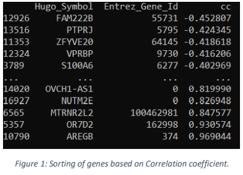
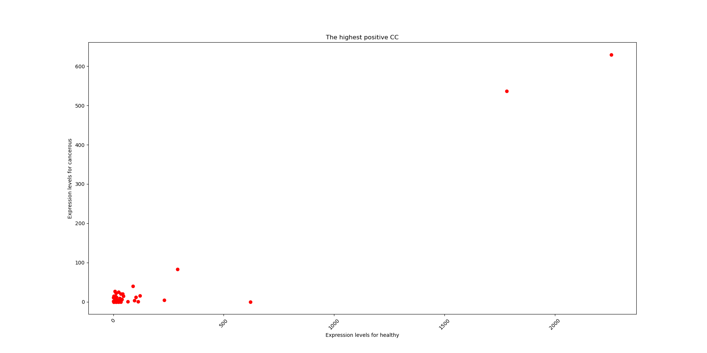
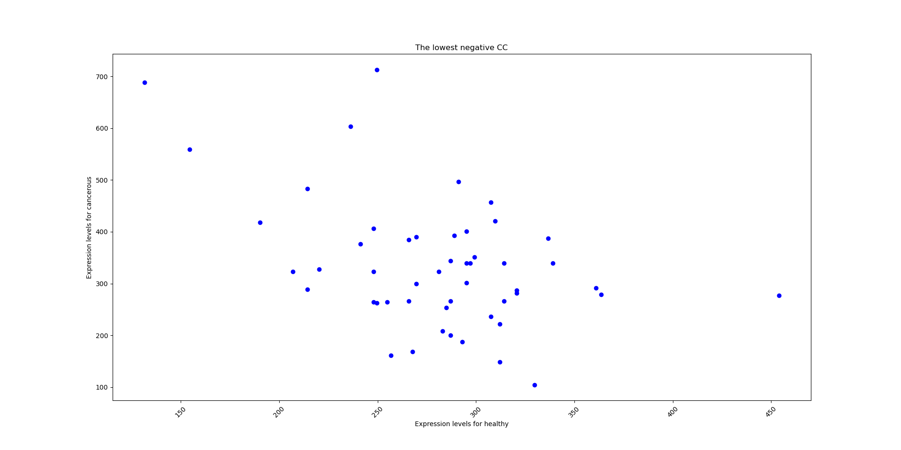

# Cancer detection
-----
## Introduction
This paper aims to improve cancer detection -for a certain type of cancer- using gene expression (GE) level as an identifier for the Lung Squamous Cell Carcinoma (LUSC). We are trying to find the correlation between gene expression levels for each gene in healthy sample and gene expression levels in cancerous sample. And using hypothesis testing to infer the deferentially expressed genes (DEGs).
 

## Methods
### Correlation
Imported used python packages are: 

- `Matplotlib.pyplot`: used for plotting.
- `Scipy.stats`: Pearson’s correlation coefficient.
- `Pandas`: to use data frames.

We store our csv files in dataframes and then we filter our dataframes by dropping rows with more than or equal to 25 zero values. Then we calculate Pearson’s correlation coefficient for each row (gene) and stored them in a list. And then create a dataframe [corr] with 3 columns: [‘Hugo_Symbol’, ‘Entrez_Gene_Id’, ‘correlation coefficient’]. Then we sorted our dataframe in ascending order according to correlation coefficient value for each gene. Then we retrieved the genes with the maximum and the minimum values for the correlation coefficient. Then we made 2 plots:

- Expression levels of different samples in cancer condition against in healthy condition for 
genes with **lowest negative** correlation coefficient.
- Expression levels of different samples in cancer condition against in healthy condition for 
genes with **highest positive** correlation coefficient. 

### Hypothesis testing

Imported python packages are:

- `Pandas`: to use data frames.
- `Scipy.stats`: used to make samples paired or independent.
- `statemodels.stats.multitest`: used to calculate FDR correction for p-values. 

We store our csv files in dataframes and then we filter our dataframes by dropping rows with more than or equal to 25 zero values. Calculate p-value for genes of independent samples by using ttest_ind and p-value for genes of paired samples by using ttest_rel and store each of them in a list. Then we apply the FDR multiple tests correction method to both lists with α= 0.05 and then we stored the results in 2 lists, one for independent samples and one for paired samples. We determined DEGs by comparing the p-values before and after FDR correction to the alpha value. If the p-value before or after FDR correction for a certain gene from a list is less than alpha then it is considered DEG. Then we stored DEGs symbols in 4 lists:

- Paired samples before FDR correction.
- Paired samples after FDR correction.
- Independent samples before FDR correction.
- Independent samples after FDR correction.
 
Then we convert both lists of DEGs for paired samples after FDR correction and for independent samples after FDR correction into sets and Compare the two sets in terms of the common and distinct genes and stored the results in 3 lists:
 
- Common DEGs between both sets.
- Distinct DEGs in the first set.
- Distinct DEGs in the second set.
 

## Results and Discussion

### Correlation

As shown in figure 1. we sorted genes in ascending order based on their correlation coefficient, so, we noticed that the first gene in dataframe is the gene with the minimum correlation coefficient value, and the last gene in dataframe is the gene with the maximum correlation coefficient.

 
As shown in figure 2, the gene with the lowest negative correlation coefficient is FAM222B and the gene with the highest positive correlation coefficient is AREGB.

As figure 3 shows, we plotted expression levels for cancer samples against expression levels for healthy samples according to the highest positive correlation coefficient. With CC nearly equal to 1, and for that we observe that almost expression levels in healthy samples are the same as expression levels in cancer samples.

Figure 3

As figure 4 shows, we plotted expression levels for cancer samples against expression levels for healthy samples according to the lowest negative 
correlation coefficient. With CC = -0.452807.

Figure 4

### Hypothesis testing

- There were 12693 DEGs in case of paired samples before FDR correction, and there were 12380 DEGs after FDR correction, we notice that the number of DEGs is less after the FDR correction because the type I error is reduced.
- There were 12600 DEGs in case of independent samples before FDR correction, and there were 12290 DEGs after FDR correction.
- There were 12211 common DEGs between the paired samples and the independent samples after FDR correction.
- There were 169 distinct DEGs in the paired samples after FDR correction.
- There were 79 distinct DEGs in the independent samples after the FDR correction.

## Conclusion
In correlation, we Compute the correlation between the normal samples and the diseased samples for each gene. Then accordingly we retrieved the gene with the lowest negative correlation coefficient and the gene with the highest positive correlation coefficient. Lastly, we plotted the relation between the expression levels of the healthy and the cancer samples according to the highest positive and the lowest negative correlation coefficients to visualize the relation.
In hypothesis testing, we determined the set of DEGs before and after the application of FDR correction test in case of paired samples and case of independent samples. Then we determined the common DEGs and the distinct DEGs of the two DEGs sets paired and independent after the application of FDR correction test.
